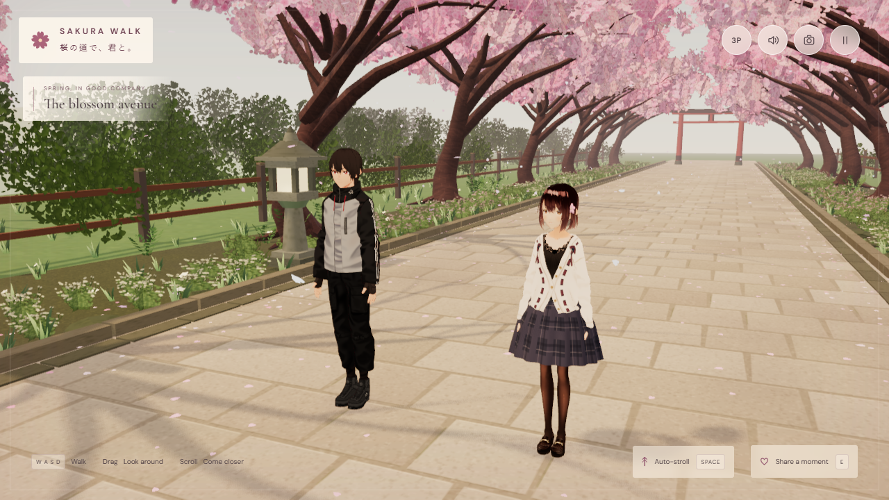
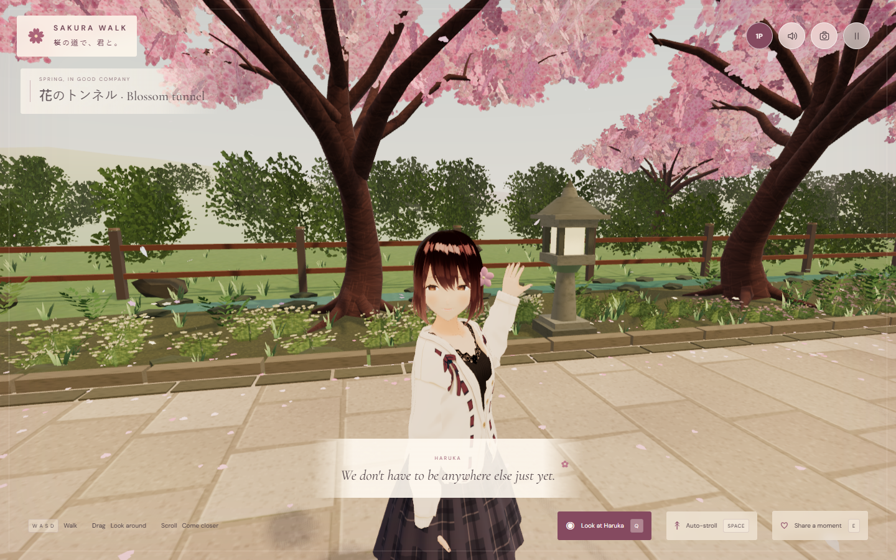

# Sakura Walk · 桜の道で、君と。

在櫻花大道上，慢慢一起走。可直接在瀏覽器遊玩的 Three.js 陪伴散步體驗。

**[開始散步 / Play](https://sion-rgb.github.io/sakura-walk/)** · **[下載 Windows 版本 / Releases](https://github.com/sion-rgb/sakura-walk/releases)**

## 這一版

- 兩位角色使用具骨架、表情和髮絲動態的 VRoid 基礎模型，重新調整服裝與配色。Haruka 設定為20歲，男生22歲，均為虛構成年人。
- 第一／第三人稱即時切換；第一人稱可望向 Haruka，同時繼續沿原方向行走。
- 同行採用共同速度加隊形修正：同步起步、停步、轉向，靠近路邊會調整站位。
- 櫻花隧道、落瓣、花叢、蕨類、苔石、小溪、石燈籠、木椅與鳥居遠景。
- 輕量環境音、招呼、拍照、觸控操作與畫質設定。沒有戰鬥或任務壓力。

角色是基於授權模型的風格化改製，並非參考插畫的一比一3D重建。主要針對桌面瀏覽器；手機操作有模擬驗證，尚未做實機效能保證。

A complete Three.js companion-walking experience. Haruka is a fictional 20-year-old adult; the player avatar is 22. The costume is school-uniform-inspired, with a wholesome, non-sexual presentation.

## Play on Windows

Double-click **Launch Sakura Walk.cmd**. It uses your existing Node.js or the Codex bundled Node runtime, starts a local server and opens the browser. The prebuilt `dist` folder is included; no npm install is needed to play. Modern Chrome/Edge/Firefox with WebGL2 is required.

Or run `node scripts/serve.mjs`, then visit http://127.0.0.1:5188/. Local server binds only to your machine. Stop a manually started server with Ctrl+C. Direct file:// opening is unsupported because the app uses ES modules.

## Controls

| Action | Control |
|---|---|
| Walk in camera-relative directions | WASD / arrow keys |
| Orbit the pair | Mouse or touch drag |
| Zoom | Mouse wheel |
| First / third person | V / 1P–3P button / pause settings |
| Look at Haruka while keeping walking direction (first person) | Q / Look at Haruka |
| Auto-stroll / stop | Space / on-screen button |
| Greet Haruka | E / Share a moment |
| Photograph mode / return | P |
| Save photograph | Button in photo mode |
| Mute | M |
| Pause / resume | Esc |
| Touch movement | Lower-left joystick |

Pause settings include volume, soft piano, afternoon warmth, gentler motion and render quality. Returning to the entrance resets both characters. Photo mode freezes the moment and allows safe camera composition. Camera elevation and zoom have limits to maintain a tasteful view.

## Develop

Node.js 20.19+ or 22.12+ recommended for Vite. Run `npm ci`, `npm run dev`, `npm run build`, or `npm run preview`. Tests: `npx playwright install chromium`, then `npm run verify:visual` with the preview server running. All browser fonts and runtime assets are local, and no API keys are used by the app. `dist/` can be served on any static HTTPS host with its relative asset URLs.

## Architecture

- `src/main.ts`: renderer, fixed-step kinematic movement/collision, companion formation, cinematic camera and UI state.
- `src/character.ts`: licensed VRoid skinned characters, distance-driven humanoid gait, blink/head-look/greeting, spring hair and authored costume details.
- `src/environment.ts`: seeded sakura avenue, instanced blossom/grass/petal kit, detailed props, GPU petal animation.
- `src/audio.ts`: original Web Audio wind, bird chirps, distant bells, footfalls and gentle instrumental notes.
- `src/style.css` / `index.html`: responsive controls, opening title, photo and pause states.
- `scripts/qa.mjs`: real-input browser checks, motion recording, portrait/landscape evidence.

The original illustration guides the mood, palette and costume direction. The revised characters adapt VRoid AvatarSample_A and AvatarSample_C with skinned humanoid animation, facial expressions, hair springs and additional costume details. Audio is synthesized, with no recorded dialogue. Physics uses 60 Hz kinematic circle collision on a level path.

First person keeps the camera at the male avatar's eye height and hides his model to avoid seeing inside the head. Q focuses on the companion while the movement direction stays unchanged; dragging releases that focus. Photo mode temporarily uses third person and restores the selected perspective afterward. The models load approximately 28 MB in total on first visit; assets remain local to the site after deployment.

## Credits and licensing

Original application code is MIT. **VRoid model files are not MIT or CC0**; their separate [sample-model conditions](licenses/VRoid-models.md) permit this free application and free redistribution subject to those terms. Model copyright remains with VRoid Project / pixiv. This project is not endorsed by pixiv. Three.js and three-vrm use MIT; bundled fonts use OFL. See `licenses/`.

Full release verification and observed limitations: [release notes](docs/verification.md). Development captures and raw tests are kept locally under artifacts; published images are actual in-game captures.
