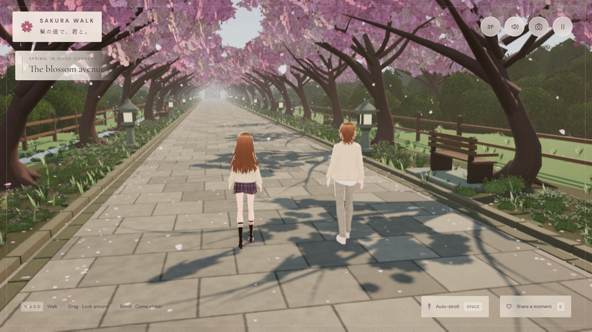
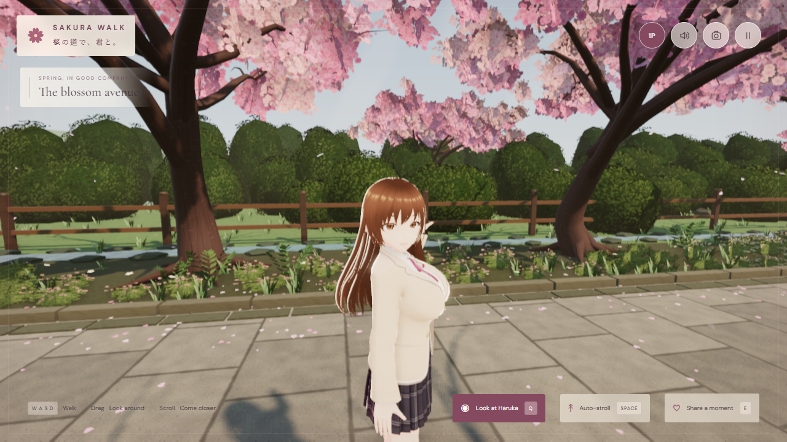

# Sakura Walk · 桜の道で、君と。

在櫻花大道上，慢慢一起走。可直接在瀏覽器遊玩的 Three.js 陪伴散步體驗。

**1.3.0 角色與光影升級**：套用使用者提供的兩位 VRM 角色，加入更清晰的樹冠陰影、戶外反射光、石材凹凸與分層植被。

**[開始散步 / Play](https://sion-rgb.github.io/sakura-walk/)** · **[下載 Windows 版本 / Releases](https://github.com/sion-rgb/sakura-walk/releases)**

## 這一版

- 1.3 光影升級：戶外 HDR 環境光、暖陽與冷色天光、隨散步範圍移動的樹冠陰影、深度環境遮蔽、依陰影計算的薄霧散射和克制的 Bloom。
- 花崗岩地磚、石材、樹皮與木欄使用分開的顏色、凹凸和粗糙度貼圖；小溪有動態波紋與環境反射，服裝、髮絲和皮革有不同的受光質感。
- 女生使用使用者提供的 BBs（作者：sion），男生使用 sssi（作者：sssi），兩者均為 VRM 1.0。保留原模型的身形比例、服裝、髮型與貼圖，接上同行、表情及髮絲動態。
- 遊戲中的 Haruka 設定為20歲，男生22歲，均為虛構成年人；以等比例縮放設定身高1.64／1.77公尺。1.3 不再套用1.2的自製髮型、服裝或虹膜覆蓋層。
- 第一／第三人稱即時切換；第一人稱可望向 Haruka，同時繼續沿原方向行走。
- 同行採用共同速度加隊形修正：同步起步、停步、轉向，靠近路邊會調整站位。
- 步態修正：按實際移動距離調整步幅，支撐腳保持地面位置，腳跟／腳尖滾動，手臂與重心自然跟隨；停步分腳收步，轉向和短暫停步後重新起步不再跳腳。見 [步態驗證](docs/verification-animation.md)。
- 櫻花隧道、落瓣、花叢、蕨類、苔石、小溪、石燈籠、木椅與鳥居遠景。
- 輕量環境音、招呼、拍照、觸控操作與畫質設定。沒有戰鬥或任務壓力。
- 瀏覽器效能升級（本地）：依實測 GPU 負載調整場景解像度，保留全尺寸 UI，支援 Native、85% Quality 和67% Performance，以及清晰縮放。見 [效能驗證](docs/verification-performance.md)。

目前角色外觀以使用者新提供的兩個 VRM 模型為準；最初的插畫仍是氣氛與配色參考。主要針對桌面瀏覽器，手機實機效能尚未驗證。

A complete Three.js companion-walking experience. Haruka is a fictional 20-year-old adult; the player avatar is 22. The costume is school-uniform-inspired, with a wholesome, non-sexual presentation.

## Environment upgrade (local implementation, 30 September 2026)

The existing scene now includes four sakura crown families, organic meadow/flower/fern/root planting, locally hosted PBR turf and stone, and forest depth behind the shrine. **N** or the moon/sun button smoothly switches between spring daylight and moonlight. The pause settings also offer both atmospheres. Moonlight adds stars, silver illumination, warm stone lanterns, mist, fireflies and restrained damp-stone reflections without reloading the characters or scene.

The added environment files total **5.59 MiB**, all CC0: [assets, authors and licences](THIRD_PARTY_ASSETS.md). Grass and fallen petals use spatial batches and distance culling. Two lantern lights are pooled, shared structures are merged, and Balanced reduces vegetation/particle density and disables post effects. Touch devices default to Balanced; the quality selector remains available. Characters and all previous controls are retained.

Environment verification: [environment verification](docs/verification-environment.md). The environment and gait upgrade was published as commit `a68a79f`; the newer adaptive-resolution upgrade remains local.

## Play on Windows

Double-click **Launch Sakura Walk.cmd**. It uses your existing Node.js or the Codex bundled Node runtime, starts a local server and opens the browser. The prebuilt `dist` folder is included; no npm install is needed to play. Modern Chrome/Edge/Firefox with WebGL2 is required.

Or run `node scripts/serve.mjs`, then visit http://127.0.0.1:5188/. Local server binds only to your machine. Stop a manually started server with Ctrl+C. Direct file:// opening is unsupported because the app uses ES modules.

## Controls

| Action | Control |
|---|---|
| Walk in camera-relative directions | WASD / arrow keys |
| Orbit the pair | Mouse or touch drag |
| Zoom | Mouse wheel |
| First / third person | V / 1P–3P button / pause settings |
| Switch controlled character: Walker / Haruka | C / ♂–♀ button / pause settings |
| Look at each other; first-person camera looks at the partner | Q / Look together |
| Day / moonlight | N / moon–sun button / pause settings |
| Auto-stroll / stop | Space / on-screen button |
| Greet Haruka | E / Share a moment |
| Photograph mode / return | P |
| Save photograph | Button in photo mode |
| Mute | M |
| Pause / resume | Esc |
| Touch movement | Lower-left joystick |

Pause settings include daylight/moonlight, volume, soft piano, afternoon warmth, gentler motion, render quality and resolution. Returning to the entrance resets both characters. Photo mode freezes the moment and allows safe camera composition. Camera elevation and zoom have limits to maintain a tasteful view.

## 畫質設定

| 模式 | 效果 |
|---|---|
| Beautiful（預設） | 2048 陰影、GTAO 接觸遮蔽、薄霧體積光、HDR Bloom，像素倍率上限1.5 |
| Cinematic | 4096 陰影、更高解析度與取樣的 GTAO／體積光，像素倍率上限2 |
| Balanced | 1024 陰影及相同的材質／戶外環境光，關閉後處理，像素倍率上限1 |

解像度可獨立於畫質選擇：**Auto** 以非同步 GPU 計時、緩慢調整和穩定區間控制場景比例（55–100%）；**Native** 使用畫質預設的完整解像度；**Quality** 使用85%；**Performance** 使用67%。縮放後以 Catmull-Rom 插值及克制的銳化輸出，介面和照片檔案仍維持顯示尺寸，細節會隨場景比例降低。沒有 GPU 計時支援時，Auto 採固定比例，觸控裝置用85%並保留 Balanced 預設。

這是空間縮放，沒有使用 DLSS、AI 重建或插幀。NVIDIA 官方 DLSS 5／Streamline 提供原生 DirectX／Vulkan 整合，目前未提供此 WebGL 網頁架構的接口。RTX 2070 SUPER 上的固定場景對照中，67%模式約節省51–53% GPU 渲染時間；結果不代表所有裝置的 FPS。詳見 [量測方法、測試和限制](docs/verification-performance.md)。

這版使用 WebGL2 即時渲染。薄霧以 shadow-map ray marching 計算光的散射，**沒有啟用硬件光線追蹤、完整路徑追蹤或動態全局光照**。水面反射來自戶外 PMREM 環境，並非鏡面反射整個場景。渲染保留 MToon 角色材質和植被實例的相容性。高解析度或較弱的裝置可改用 Balanced；手機實機效能仍未驗證。

## Develop

Node.js 20.19+ or 22.12+ recommended for Vite. Run `npm ci`, `npm run dev`, `npm run build`, or `npm run preview`. Tests: `npx playwright install chromium`, then `npm run verify:visual` with the preview server running. All browser fonts and runtime assets are local, and no API keys are used by the app. `dist/` can be served on any static HTTPS host with its relative asset URLs.

## Architecture

- `src/main.ts`: renderer, fixed-step kinematic movement/collision, companion formation, cinematic camera and UI state.
- `src/character.ts`: user-supplied VRM 1.0 characters, grounded three-dimensional leg IK, heel/toe support, start/stop/turn blending, blink/head-look/greeting and VRM spring motion. The model files retain their original geometry, textures and embedded metadata.
- `src/sakura-gait.ts`: continuous distance-driven foot trajectories and a cached shoe support envelope; no per-frame shoe-vertex skinning.
- `src/character-hair.ts`, `src/character-wardrobe.ts`, `src/character-face.ts`: legacy 1.2 reference-inspired overlays retained in the source; these are not used by the 1.3 character loader.
- `src/environment.ts`: seeded sakura avenue, instanced blossom/grass/petal kit, detailed props, GPU petal animation.
- `src/environment-materials.ts`: local CC0 albedo/normal/roughness/AO surfaces, night damp-stone response and generated water normals, with linear data maps.
- `src/lighting.ts`: procedural day/star/moon sky, local day/night HDRs blended as PMREM, and stabilized directional shadows.
- `src/render-pipeline.ts`, `src/atmosphere-pass.ts`: actual beauty-depth GTAO, shadow-marched mist, HDR bloom and quality presets. Avatar masks and cutout foliage remain in the depth source.
- `src/adaptive-resolution.ts`, `src/resolution-output.ts`: asynchronous GPU timing, automatic scene-resolution control, and spatial reconstruction with the existing tone mapping and color conversion.
- `src/audio.ts`: original Web Audio wind, bird chirps, distant bells, footfalls and gentle instrumental notes.
- `src/style.css` / `index.html`: responsive controls, opening title, photo and pause states.
- `scripts/qa.mjs`: real-input browser checks, motion recording, portrait/landscape evidence.
- `scripts/qa-gait.mjs`, `scripts/review-gait.mjs`: translated slow/steady/start/stop/turn/restart gait checks and actual scene motion captures. The focused rig test uses the development server on port 5190.
- `scripts/qa-environment.mjs`: day/night, smooth transition, night companionship, asset reuse and responsive checks.
- `scripts/qa-lighting.mjs`: quality switching, shader/GL checks, resize and measured frame timing. Verification record: [docs/verification-v1.3.md](docs/verification-v1.3.md).
- `scripts/qa-resolution.mjs`, `scripts/profile-resolution.mjs`: resolution, fallback, photograph and companion regression checks; native versus67% GPU comparison. Verification record: [docs/verification-performance.md](docs/verification-performance.md).

The original illustration guides the mood and palette. Version 1.3 uses the user's BBs and sssi VRM 1.0 models for the companion and walker, respectively. Their supplied appearance replaces the earlier sample-based character design. Audio is synthesized, with no recorded dialogue. Physics uses 60 Hz kinematic circle collision on a level path.

The two new VRM files are copied without binary changes; runtime uniform scaling, animation and rendering do not rewrite them. Facial expressions and VRM spring bones use the supplied rig. Clothing follows its skinned mesh; this is not full physical cloth simulation. Older sample files (`haruka.vrm`, `walker.vrm`) and the 1.2 iris asset remain in the source for the earlier implementation but are not requested by the active character loader. Their original licensing still applies. The source reference sheet is not included in the distribution.

First person keeps the camera at the male avatar's eye height and hides his model to avoid seeing inside the head. Q focuses on the companion while the movement direction stays unchanged; dragging releases that focus. Photo mode temporarily uses third person and restores the selected perspective afterward. The two active model files total 32,850,812 bytes (about 32.9 MB before HTTP compression) on first load; runtime assets are served by the same site.

## Credits and licensing

Original application code is MIT. **The model files are not covered by the code's MIT license and are not CC0.** The active BBs model by sion and sssi model by sssi use the VRM Public License 1.0 together with their embedded permissions and restrictions; see [user-model provenance, hashes and conditions](licenses/User-models.md). Their embedded settings permit redistribution and modification with redistribution, and retain restrictions on excessively violent or sexual, political or religious, and antisocial or hate usage.

The legacy VRoid sample files remain subject to their separate [sample-model conditions](licenses/VRoid-models.md), with copyright retained by VRoid Project / pixiv. This project is not endorsed by pixiv. Three.js and three-vrm use MIT; bundled fonts use OFL. See `licenses/`.

Version 1.3 local production verification passed28 real-input checks and7 rendering checks; see [1.3 verification and limits](docs/verification-v1.3.md). Historical verification: [1.2 character correction](docs/verification-v1.2.md), [1.1 release notes](docs/verification.md). Development captures and raw tests are kept locally under artifacts; prior-version evidence does not establish verification of the new models.
