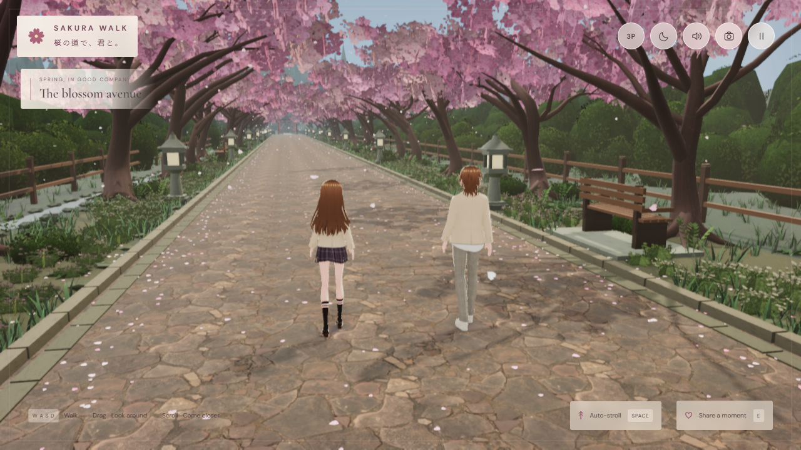
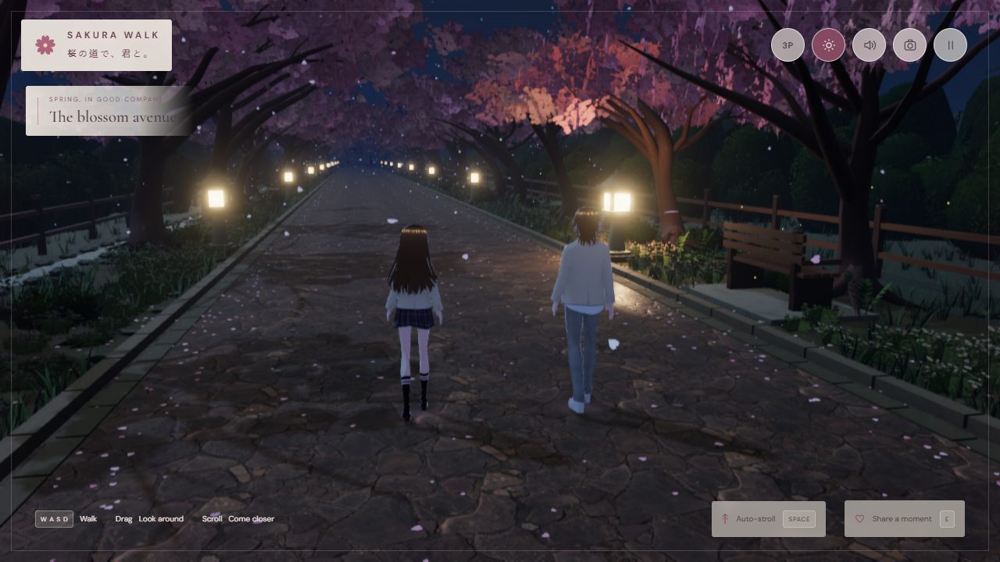

# Sakura Walk — environment upgrade verification

30 September 2026. **Local production build**, application chunk `index-7xd8v_ps.js`, Windows 11 / Chromium / RTX 2070 SUPER. This upgrade is not yet published to GitHub Pages. Structured results: [verification-environment.json](verification-environment.json).

## Changes and retained features

The existing plain Three.js/Vite architecture is retained. Four seeded sakura branch/crown families, uneven spacing, varying canopy proportion and crossed blossom sprays form an airy tunnel. The garden has clustered narrow grass, flowers, ferns, low rosettes, root shrubs, moss stones and wind-sorted fallen petals. Textured rolling hills and 245 forest trees complete the shrine approach. Stone lanterns, fencing, benches, torii and the existing shrine remain coherent with the avenue.

Local grass and stone surfaces use separate sRGB albedo and linear OpenGL normal, roughness and AO maps. The path is rough stone, with a little moss at the edges and limited damp patches at night. Two local HDRs are prefiltered and blended for environment illumination/reflections. Direct light, sky, fog, exposure, lantern emission, fireflies, petal colour and post processing blend together. N, the moon/sun button and pause settings select daylight or moonlight without reloading assets. Stars and silver-blue illumination distinguish night; nearby stone lanterns provide warm pools of light.

Character implementation, geometry, textures and audio code were not changed. Both supplied VRMs match their original SHA-256 records in [User-models.md](../licenses/User-models.md), including built copies. Walking, companion formation, first/third person, gaze, greetings, photo mode, audio, collision bounds and all 88 colliders remain present.

## Tests and visual review

- TypeScript check, Vite production build and Git whitespace check passed.
- **28/28 existing real-input checks**: walking/stopping/turning, side switching, both model identities, first/third-person and gaze, greeting, audio, pause/resume, photo download, touch joystick and resizing.
- **23/23 environment checks**: eight daytime/moonlight views, ten local asset loads, smooth transition without position reset/new requests/recreated geometry, night walking and reversal, paused light selection, all quality modes, portrait/landscape layout and touch switching.
- **7/7 render checks**: shadow sizes, AO/mist presets, warmth, resize, GL/framebuffer status and shader diagnostics.
- Normal production launch passed without QA hooks; both supplied VRMs load, no legacy overlay requests, no external runtime requests, all settings fit at 1280x720.
- **12 fresh acknowledged canvas captures**: desktop day/night active, close, vista and first-person views at 1280x720; mobile day/night active and first-person views at 390x664. Additional real-input mobile checks used 390x844 and 844x390.
- Day, moonlight, foreground planting, path, skyline and mobile captures were visually inspected. Fixed pale broad grass, exposed hillside patches and lantern relocation popping. Real-input walking was recorded; separate night walking/stop/reverse/first-person/greeting captures were reviewed.
- No console/page errors or failed runtime asset requests. ANGLE reported non-actionable X4122 double-precision constant rounding in generated shaders; no GL errors or broken framebuffers.

Scripts: `scripts/qa.mjs`, `scripts/qa-environment.mjs`, `scripts/qa-lighting.mjs`, `scripts/production-smoke.mjs`, `scripts/inspect-threejs-canvas.mjs`. Raw reports, screenshots, motion clips and the current-run evidence manifest remain locally under `artifacts/environment-final` and `artifacts/evidence.json`.

## Performance and scope

| Matched active desktop view, Beautiful | Original v1.3 baseline | Upgraded |
| --- | ---: | ---: |
| Day draw calls | 139 | 153 |
| Day rendered triangles | 970,329 | 845,549 |
| First-person triangles | 882,761 | 651,386 |
| Texture count | 120 | 126 |
| Day median frame / p95 | 13.3 / 13.4 ms | 13.3 / 13.5 ms |

Night Beautiful measured 154 calls / 845,549 triangles, median 13.3 ms and p95 13.5 ms. Cinematic and Balanced also stayed near 13.3 ms median in this GPU/browser; timings are display capped near 75 Hz and are not a universal FPS claim.

Grass is divided into 21 spatial sections and floor petals into 12. Proximity culling, shared geometry/maps, merged structural meshes, simpler shrub cores and GPU particle animation control cost. Only two non-shadowed lantern lights are active, with fade-out/relocation/fade-in. Balanced caps DPR at 1, uses 1024 shadows, disables post effects and reduces grass, ground petals, airborne petals and fireflies. Touch devices default to Balanced and can change quality.

The four CC0 assets add **5,864,366 bytes (5.59 MiB)** across ten locally hosted files; see [asset licences and hashes](../THIRD_PARTY_ASSETS.md). No heavyweight external model pack was imported.

### Genuine limits

- Mobile verification is Chromium touch/viewport emulation on the desktop GPU; phone hardware performance is unverified.
- Texture counts and some triangle counts exceed conservative starter budgets, particularly on mobile. Preserved avatars retain their existing textures and approximately 32.9 MB initial model download. Balanced is a fallback, not evidence for every weaker device.
- This is WebGL rasterization with shadow-map volumetric scattering and prefiltered environment reflections. There is no hardware ray tracing, full path tracing, dynamic GI or live scene mirror reflection.
- Distant terrain/trees are deliberately simple shared geometry; this is a stylized interactive scene, not a photoreal scanned world.
