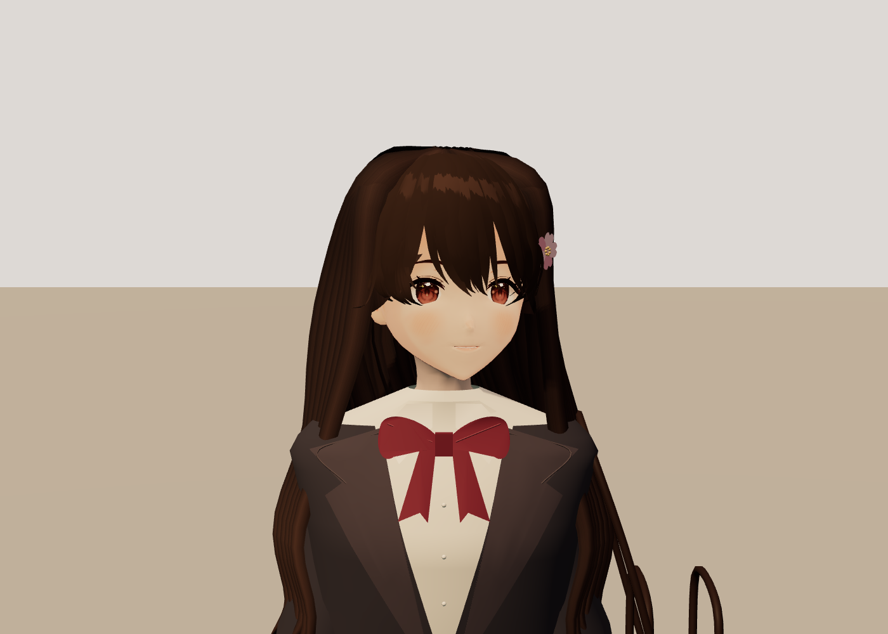

# Sakura Walk 1.2.0 — character correction

29 September 2026. Verification of version1.2.0. Previous release evidence is in [verification.md](verification.md).

## Character

Haruka now has long dark layered hair, a sakura clip, charcoal blazer, cream blouse, burgundy bow, plaid pleats, knee socks, loafers and a leather satchel with a pink charm. A locally bundled AI-assisted iris atlas supplies warmer chestnut eyes. The original adult character setting, expressions, walking and both perspectives remain.

The cardigan hood was removed. The replacement torso, lapels and shirt are skinned to the existing rig. Long locks blend toward the shoulder direction when she looks at the player. Collar coverage, bow placement and skirt waist were corrected during inspection.

The underlying face remains VRoid AvatarSample_A. This is a reference-inspired adaptation, not an exact sculpt of the illustration. Hair forms, collar and facial shading remain simpler than the painted reference. Hair and cloth use authored deformation rather than physical simulation.

## Verification

- TypeScript and Vite build passed; application chunk `index-C11P5gJ6.js`.
- Final real-input Chromium checks: **27/27 passed**, zero page/console errors and failed requests.
- Four fresh canvas captures: desktop walking, companion view and first-person companion view; mobile first-person companion view. All states acknowledged and nonblank, without browser errors.
- Production smoke passed: start, pause/resume, perspective switching and companion gaze. Debug hooks absent during normal launch. Both VRMs and iris PNG returned HTTP200; no external runtime requests.
- Front, face, side, back, walking and greeting views inspected. Real-input motion recorded and sampled for walking, turning and perspective changes.
- Original model blob hashes unchanged: A `3c1266141851452f51d473cbb12caceb3ce02025`; C `645b9e26c76586d72850cd5fdb5da4ceeb4e018b`.

First-person walking measured both characters at1.12m/s with1.18m separation. Both stopped at zero speed. Turns retain a short catch-up period. V switches perspective; Q looks at Haruka while preserving movement heading; E greets her.

## Rendering and limits

Windows11 / NVIDIA RTX2070 SUPER / Chromium. Counts include render passes.

| Metric | Version1.1.0 | Version1.2.0 |
|---|---:|---:|
| Active third-person calls |148|186|
| Active rendered triangles |624134|656122|
| First-person companion-view calls |108|146|
| First-person rendered triangles |569720|601708|
| Loaded textures |103|96|

Recorded desktop frame timer samples were approximately60–75FPS. Added hair and clothing increase draw calls and geometry. Textures exceed the skill's60-texture starting desktop budget; mobile triangle and texture budgets are also exceeded. Physical phone performance is unverified. Balanced quality lowers resolution and post-processing cost.

Models total28.2MB; the iris PNG is461887bytes. No API keys are required to play. External model-generation credentials were unavailable, so this uses authored geometry over the licensed rig and one locally generated texture.

Active desktop pixels:6.04bits color entropy,0.530 edge density,174.6 luminance contrast. First-person pixels:6.41bits,0.550,188.7. These establish coverage/contrast, not character likeness. This narrow correction does not re-score unchanged systems or claim a new whole-game quality rating.

## Reproduce

Run `npm ci`, install Chromium, then `npm run build`. Start `node scripts/serve.mjs` on localhost5188. Set `QA_URL=http://127.0.0.1:5188/` and run `npm run verify:visual` plus `node scripts/production-smoke.mjs`. QA hooks only exist under `?qa=1`.

The portable archive contains source, dist, licensing and the Windows launcher. Double-click `Launch Sakura Walk.cmd` to play with an existing Node runtime. See the [separate model conditions](../licenses/VRoid-models.md).
