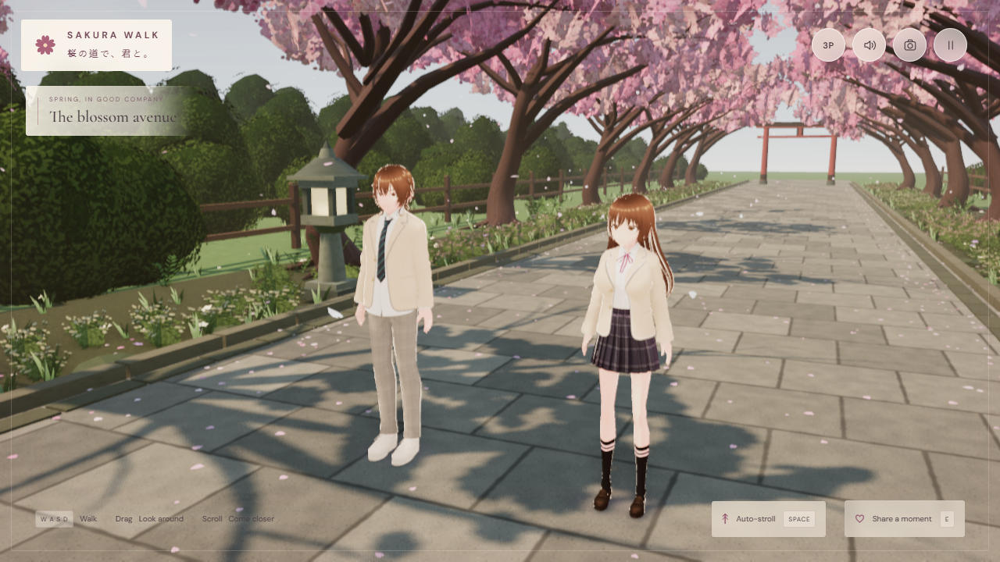

# Sakura Walk 1.3.0 — supplied characters and spring lighting

30 September 2026. Local production verification of application chunk `index-DqqnQ_gL.js`, on Windows 11 / Chromium / NVIDIA RTX 2070 SUPER. This record supersedes earlier local lighting-only and single-character experiments. Structured results: [verification-v1.3.json](verification-v1.3.json).

## The two supplied models

- Companion: **BBs by sion**, supplied as `BBs_.vrm`, distributed as `models/bbs-companion.vrm`.
- Walker: **sssi by sssi**, supplied as `sssi.vrm`, distributed as `models/sssi-walker.vrm`.
- Both are VRM 1.0 from VRoid Studio 2.14.0, with humanoid rigs, facial expressions and spring bones. Source, public and built model files are byte-identical; hashes and all embedded permissions are in [User-models.md](../licenses/User-models.md).
- The supplied body shapes, outfits, hair and textures replace the earlier custom overlays. Only uniform height scaling, poses and outdoor toon-light response are adjusted at runtime. Haruka remains a fictional adult aged20; the walker is22.
- VRM1 X/Z rotation conventions are handled explicitly. The gait accounts for imported leg rest angles, plants the supporting foot and swings each arm opposite its corresponding leg. Idle, blink, head/eye gaze, greeting and hair motion remain active.

## Lighting and environment

The scene uses warm sunlight and cool sky fill, stabilized moving PCF shadows, alpha-cut blossom shadow filters, outdoor PMREM illumination/reflections, beauty-depth GTAO, shadow-map volumetric mist and restrained HDR bloom. Granite, bark, stone and cedar use separate albedo and linear relief/roughness maps. Water has animated normals and environment reflections. Layered shrubs and distant terrain complete the avenue.

Beautiful uses2048 shadows; Cinematic4096 plus higher AO/volumetric sampling; Balanced1024 without post-processing. **This is WebGL2 rasterization with shadow-map ray marching, not hardware ray tracing or full path tracing.** Water reflects the prefiltered environment, not live scene geometry. Clothing is skinned, not a full cloth simulation.

## Verification performed

- TypeScript check and Vite production build passed.
- **28/28 real-input browser checks passed**, including both new model identities, walking, stopping, turning, edge formation, greeting, audio, pause, photo download, first/third person, gaze while walking, touch controls and portrait/landscape resizing.
- **7/7 rendering checks passed**: three quality presets and return switch, warmth control, resize, and no GL/framebuffer error. No page/console errors or failed runtime requests.
- Production launch passed without QA hooks: start, pause/resume, first/third person and gaze; both new VRMs returnedHTTP200; no legacy models/iris overlay or external runtime requests.
- Six fresh, acknowledged canvas captures passed: desktop active/close/first-person/vista at1280×720; mobile active/first-person at390×664 CSS pixels. Real-input responsive checks additionally used390×844 and844×390.
- Original model files match the copies in `public` and `dist` by SHA-256.
- Front, side, back, walking and greeting renders inspected. A40.56-second real-input motion recording was sampled for walking, turning, first-person companionship and greeting. An independent review found out-of-phase arms; the final pass fixes this by sharing the foot trajectory with arm counter-swing. Pale fabric/face light response was also refined.
- Twelve gait samples per model measured supporting sole clearance: BBs **0.46–3.05mm**, sssi **2.40–2.94mm**, with no ground penetration in those samples. These are bounded sampled checks, not a proof of every possible pose.

Steady first-person walking measured **1.12m/s for both characters**, with **1.180m separation**. Both settled to zero speed after stopping; sharp turns use a brief catch-up period.

## Performance and limits

Counts include render passes. The previous release values come from its published verification record; the scenes/assets differ, so this is not an isolated renderer benchmark.

| Metric | v1.2 | v1.3 |
|---|---:|---:|
| Active third-person draw calls |186|139|
| Active rendered triangles |656,122|970,329|
| First-person draw calls |146|102|
| First-person rendered triangles |601,708|882,761|
| Loaded textures |96|120|

At1440×900, the final preset checks measured a13.3ms median requestAnimationFrame interval and13.4ms p95, approximately75Hz display cadence. Actual input samples were about74–75FPS on this GPU. These are local, display-limited measurements, not GPU-only frame times or a guarantee for other devices.

The richer world and unmodified supplied avatars exceed the skill's starting triangle/texture budgets (desktop750k triangles/60 textures; mobile lower). Instancing limits draw calls; Balanced removes post effects and reduces pixel ratio, but does not reduce avatar geometry. Physical-phone performance and other browsers were not tested. First-load model payload is32.9MB before HTTP compression.

ANGLE emitted a generated-shader **X4122 constant-rounding warning**, retained in the report. It did not prevent compilation; `gl.getError()` returned0. No other shader/framebuffer warning was observed.

Desktop active pixels:6.10bits entropy,0.555 edge density,154.1 luminance contrast; first-person:6.66bits,0.561,177.3. Mobile active:5.91bits,0.525,158.1. Pixel measures establish coverage and contrast, not artistic likeness.

## Visual review

The three installed visual calibration anchors were inspected. Scores below describe the complete declared desktop/mobile capture set, using walking-experience equivalents. The previous release was not re-scored in this pass; no numeric improvement is inferred.

| Category / walking equivalent | Before | Current | Evidence and remaining limits |
|---|---|---:|---|
| Art direction / spring companionship |Not re-scored|2.5|Consistent warm spring palette, blossom canopy and restrained interface.|
| Hero / walking pair |Not re-scored|2.5|Two authored VRMs, matching costume language, faces, gaze and corrected gait; faces remain stylized and bright.|
| Obstacles / path boundaries |Not re-scored|2|Stone edges, fencing and88 collision proxies; no combat obstacles are intended.|
| Interactions / greeting and photographs |Not re-scored|2|Wave, caption, gaze toggle, photo feedback and actual download verified.|
| World / avenue and garden |Not re-scored|2.5|Foreground planting, layered canopy, rill, furnishings and distant terrain; tree structure repeats.|
| Materials / natural surfaces and clothing |Not re-scored|2|Independent relief and roughness, plaid and toon textures; no physical cloth.|
| Lighting / depth and atmosphere |Not re-scored|2.5|Readable dappled shadows, cool fill, contact shading and restrained scatter; no true ray tracing.|
| VFX and motion / petals and companionship |Not re-scored|2|Breeze-driven petals, spring hair, blink and distance-driven walking; no motion-capture animation.|
| UI / quiet controls and responsive layouts |Not re-scored|2.5|Both perspectives, touch, pause and photo states fit tested viewports.|
| Performance evidence |Not re-scored|2.5|Fresh metrics, builds, real input, motion and preset tests; physical phones remain unverified.|

Average2.3/3 is a calibrated internal assessment, not a claim of illustration-level fidelity or showcase quality. No automatic visual-review failure was observed in this capture set.

## Reproduce

Run `npm ci`, install Playwright Chromium, then `npm run build` and `node scripts/serve.mjs`. With `QA_URL` set to the local server, run `node scripts/qa.mjs`, `node scripts/qa-lighting.mjs` and `node scripts/production-smoke.mjs`. QA hooks exist only with `?qa=1`.

For isolated character inspection, start Vite on5190 and run `node scripts/review-proportions.mjs`; set `QA_ROLE=player` for the male model. Raw captures, logs, motion and the `supplied-pair-release` evidence manifest remain locally under `artifacts/`. The portable ZIP includes source, built assets, separate model licensing and the Windows launcher.
